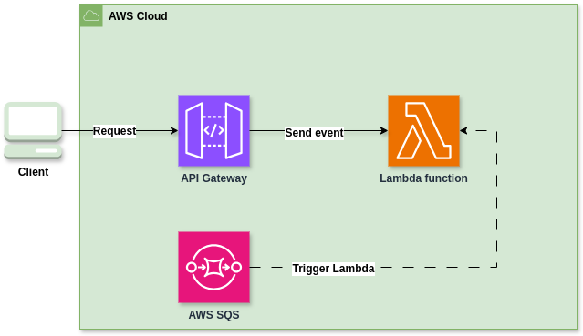
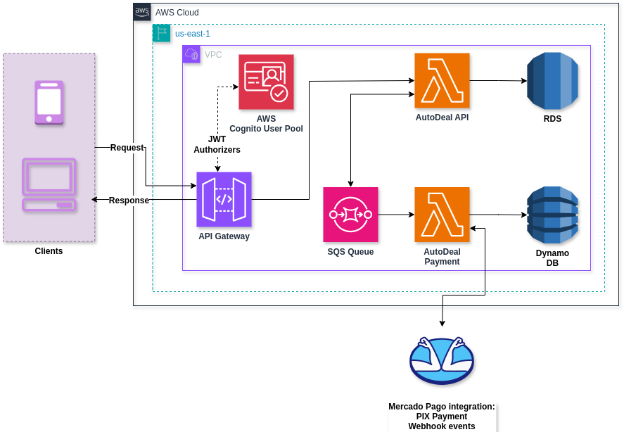
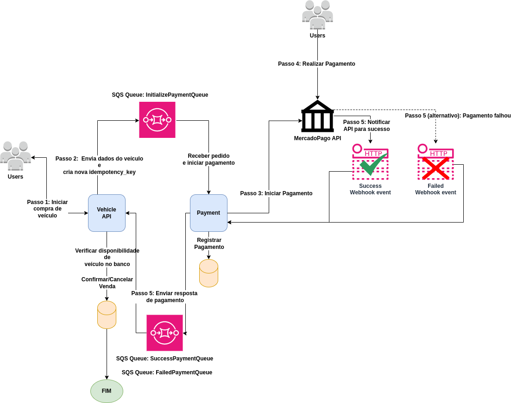
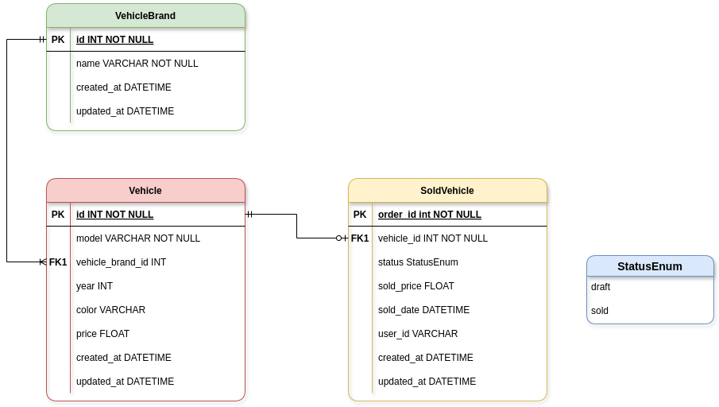

# AutoDeal API - Uma solução AWS Lambda com Docker

Aluno:

* Pedro Henrique de Marins da Silva - RM348617

## Lista de Repositórios:
  - [Repositório AutoDeal API](https://github.com/auto-deal-cars/auto-deal-api)
  - [Repositório AutoDeal Payment](https://github.com/auto-deal-cars/auto-deal-payment)

## O Projeto

Uma empresa de revenda de veículos automotores nos contratou pois quer implantar uma
plataforma que funcione na internet, sendo assim, temos que criar a plataforma. O time de UX já está criando os designs, e ficou sob sua responsabilidade criar a API, para que posteriormente o time de frontend integre a solução. O desenho da solução envolve as seguintes necessidades do
negócio:

- Cadastrar um veículo para venda (Marca, modelo, ano, cor, preço);
- Editar os dados do veículo;
- Permitir a compra do veículo via internet para pessoas cadastradas. O cadastro deve ser feito anteriormente à compra do veículo;
- Listagem de veículos à venda, ordenada por preço, do mais barato para o mais caro;
- Listagem de veículos vendidos, ordenada por preço, do mais barato para o mais caro.

Este projeto foi gerado com o template `aws-python-docker` do [Serverless framework](https://www.serverless.com/).

Para mais detalhes, por favor, referir para a [documentação](https://www.serverless.com/framework/docs/providers/aws/).

## Stack do Projeto

- **AWS Lambda:** Funções que rodam a partir de eventos gerados, podendo ser invocadas através de uma API Gateway ou SQS Queue
- **AWS API Gateway:** Criação de API endpoints para a aplicação.
- **AWS SQS:** Criação de filas do SQS para a comunicação entre os serviços.
- **AWS DynamoDB:** Banco de dados NoSQL da AWS que armazena os dados de pagamento da aplicação.
- **AWS RDS:** Banco de dados relacional da AWS que armazena os dados da aplicação.
- **AWS Cognito:** Serviço de autenticação da AWS que armazena os dados do usuário.
- **AWS Elastic Container Registry:** Registro de imagens do Docker da AWS.
- **AWS S3:** Bucket da AWS que armazena os arquivos estáticos da aplicação.
- **Python:** Linguagem de programação utilizada para a criação das funções Lambdas.
- **Docker:** Tecnologia de containerização utilizada para o build das imagens das funções Lambdas.
- **Serverless Framework:** Framework utilizado para o deploy das funções Lambdas. Responsável por transformar o serverless.yml em um template do CloudFormation.
- **Pydantic:** Biblioteca utilizada para a criação de modelos de dados para a aplicação.
- **SQLAlchemy:** Biblioteca utilizada para a criação do ORM (Object Relational Mapping) para a aplicação.
- **Boto3:** Biblioteca utilizada para a criação do cliente da AWS. Utilizado para chamar as filas.
- **Pytest:** Framework utilizado para o testes da aplicação.
- **Swagger:** Documentação da API.

## Infraestrutura

Foi escolhida uma abordagem Serverless para essa solução, utilizando o AWS Lambda para a execução das funções e o AWS API Gateway para a criação das rotas da API.
Esta arquitetura permite o desenvolvimento do código da solução sem a preocupação em gerenciamento de servidores, focando no código da solução.

As funções Lambdas podem ser invocadas a partir de eventos(triggers) para rodar código. No caso das APIs, os triggers serão rotas criadas no nível do API Gateway.

A solução requer a utilização de Docker para o build das imagens das funções Lambdas e a utilização do Serverless Framework para o deploy das funções.
Criação e deploy Lambda functions utilizando containers possui os seguintes benefícios:

- **Facilidade de manutenção**: O código da função está contido em um container, o que facilita a manutenção e o gerenciamento da infraestrutura.
- **Isolamento**: O ambiente de execução das funções é isolado do ambiente de desenvolvimento, o que facilita o gerenciamento das dependências das funções.
- **Imutabilidade**: O ambiente de execução é imutável, garantindo que o código funcione da mesma forma em diferentes ambientes.
- **Portabilidade**: Containers podem ser executados em qualquer ambiente que suporte Docker, facilitando a migração entre diferentes provedores de cloud ou ambientes on-premises.
- **Segurança**: Containers oferecem um nível adicional de isolamento, ajudando a proteger a aplicação contra vulnerabilidades.
- **Consistência**: Garantia de que o ambiente de execução é consistente em todas as fases do desenvolvimento, desde a máquina do desenvolvedor até a produção.

> **Sobre o deploy**: A infraestrutura foi configurada utilizando componentes do Serverless Framework, o que facilita o deploy das funções Lambdas. Na pasta raiz do projeto, existe um arquivo chamado `serverless.yml` que contém as configurações do deploy. Os containers gerados durante o comando de deploy são enviados para a AWS Lambda através de imagens que são geradas e encaminhadas para o ECR (Elastic Container Registry) da AWS.

### Utilização de arquitetura arm64 nas funções Lambdas

A arquitetura X86 é a primeira opção quando falamos de computadores e servidores. Porém, os avanços da arquitetura ARM estão cada vez mais presentes. Oferecendo muitos benefícios, como menor custo, maior velocidade e eficiência.

O processador Graviton2 é um processador que foi oferecido pela AWS para a arquitetura ARM. O Graviton2 já provou ter performance impressionante em comparação com processadores da família X86, impulsionando o desempenho dos serviços.

Essa arquitetura foi escolhida por ser uma arquitetura que oferece suporte ao processamento de forma mais rápida e eficiente.
Além disso, utilizar a arquitetura ARM oferece o benefício de reduzir a emissão de gases de efeito estufa.

### Cognito User Pool para autenticação

O serviço de autenticação foi implementado utilizando o Cognito User Pool, que é um serviço da AWS que oferece autenticação e autorização para aplicações web. Essa solução foi escolhida por ser uma solução de autenticação que oferece suporte ao OAuth 2.0, o que facilita a implementação de autenticação e autorização em aplicações front-end.

### Triggers das Lambdas: API Gateway e SQS Queues

As funções Lambdas possuem triggers configurados para rodarem a partir de eventos gerados, dois tipos de triggers são utilizados: 
- **API Gateway**: As funções são invocadas a partir de eventos gerados pelo API Gateway, que são as rotas da API. Funções utilizando essa solução fazem parte da criação de API endpoints. Essas API endpoints podem ser utilizadas em um client (aplicação front-end), e são protegidas por meio de um JWT Authorizer
- **SQS Queues**: As funções são invocadas a partir de eventos gerados pelo SQS Queues, que são as filas do SQS. Essa abordagem é utilizada para comunicação entre os serviços.

> **Sobre JWT Authorizers**: O JWT Authorizer é um componente do API Gateway que permite a criação de um Authorizer que valida o JWT (JSON Web Token) enviado pelo client. Esse Authorizer é utilizado para proteger as API endpoints, garantindo que somente usuários autenticados possam acessar essas endpoints. Os tokens são gerados por meio do serviço de autenticação, utilizando a solução AWS Cognito User Pool.

### Pipeline

A pipeline para deploy do código foi configurada utilizando o GitHub Actions, a pipeline possui os seguintes passos:

- **Checkout code**: Utiliza a ação `actions/checkout@v2` para fazer o checkout do código fonte do repositório.
- **Set up Python**: Configura o ambiente Python usando `actions/setup-python@v4` com a versão 3.10.
- **Install dependencies**: Instala as dependências do projeto listadas no arquivo `requirements.txt` e o `pytest` para testes.
- **Run tests**: Executa os testes utilizando `pytest` para garantir que o código está funcionando corretamente.
- **Create envfile**: Cria um arquivo `.env` com a variável `DATABASE_URL` utilizando a ação `SpicyPizza/create-envfile@v2.0`.
- **Run Alembic migrations**: Executa as migrações do banco de dados utilizando `alembic upgrade head`.
- **Set up QEMU**: Configura o QEMU para emulação da arquitetura ARM para realizar o build da imagem Docker, usando a ação `docker/setup-qemu-action@v3`.
- **Deploy if tests pass**: Se os testes passarem, instala o Serverless Framework e plugins necessários, e realiza o deploy da aplicação utilizando `sls deploy`.
- **Clean up .env file**: Remove o arquivo `.env` após o deploy ser realizado com sucesso.

> **Sobre a utilização do QEMU**: O Github Actions não suporta a emulação da arquitetura ARM nativamente, porém, o QEMU permite a emulação da arquitetura ARM para construir a imagem Docker.

### Regras gerais para utilização

- **Branches**: As branchs do projeto devem seguir o padrão `feature_<nome-da-feature>` para novas features, e `fix_<nome-do-bug>` para correções de bugs.
- **Commits**: Os commits do projeto devem seguir o padrão `<tipo>: <descrição>`. Os tipos possíveis são: `feat`, `fix`, `perf`, `docs`, `style`, `refactor`, `test`, `chore`, `ci`, `build`, `revert`.
- **Pull Requests**: Código só pode ser mergeado para a branch `main` através de pull requests.
- **CI/CD**: A aplicação possui CI/CD através do GitHub Actions, onde o código é buildado e deployado para a AWS Lambda através do Serverless Framework.
- **Documentação das APIs**: A documentação do projeto foi feita utilizando o Swagger, e está disponível na raiz do projeto, no arquivo `openapi.yml`. Para rodar localmente, utilize o comando `swagger-ui-express --config openapi.yml --port 8080`.

## Arquitetura

A abordagem de microserviços utilizando funções Lambda foi escolhida por ser uma abordagem que oferece suporte ao desenvolvimento de uma aplicação distribuída, onde cada serviço possui seu próprio banco de dados, e a comunicação entre os serviços é feita através de mensagens (SQS Queues).
No caso do serviço de compra de veículo, o serviço chamado API de veículo envia uma mensagem para a fila do SQS, que é processada pelo serviço de Payment de veículo.

### Funções utilizando conceitos de Arquitetura Hexagonal
A abordagem de arquitetura hexagonal também pode ser utilizada para a criação de funções Lambda, utilizando o conceito de **Ports e Adapters**. Alguns detalhes sobre atores:

  - Condutores: (ou atores primários): Podem ser definidos como atores que iniciam a interação. Por exemplo, um condutor pode ser um controller que recebe um input de um usuário e redireciona a aplicação utilizando uma Port(interface).
  - Conduzidos: (também conhecido como atores secundários): São parte da camada de infrasctructure da aplicação. Podem ser utilizados para adicionar funcionalidades para o domínio da aplicação. Exemplos: Banco de dados, APIs externas.

### Padrão SAGA

A abordagem de mensagens utilizando filas do SQS permite a comunicação entre os serviços de Vehicle e Payment, garantindo a confiabilidade e integridade dos dados em caso de erros. Mesmo utilizando uma solução distribuída de banco de dados, garantindo a consistência.
Adicionamente, o padrão SAGA utilizado para essa aplicação é o padrão Coreografia, onde não existe um orquestrador, e cada saga é uma transação.
Para cobrir falhas, a aplicação possui a seguinte estratégia:
  - **Compensação**: Eventos compensatórios para reverter vendas, caso ocorra algum erro.
  - **Chave de idempotência**: Identificador único para garantir que uma transação seja executada apenas uma vez.

### Modelo de dados (RDS)

O modelo de dados do serviço API é um banco de dados relacional, utilizando o RDS (PostgreSQL) como serviço de banco de dados. O banco de dados possui as seguintes tabelas:
- **Vehicle**: Tabela que armazena os veículos disponíveis à venda.
- **VehicleBrand**: Tabela que armazena as marcas de veículos.
- **SoldVehicle**: Tabela que armazena os veículos vendidos.
- **Enum: StatusEnum**: Tabela que armazena os status dos veículos vendidos. Possíveis valores:
  - **draft**: Venda inicializada.
  - **sold**: Venda concluída.

#### Estrutura das tabelas
##### Vehicle
| Coluna       | Tipo         | Descrição                        |
|--------------|--------------|----------------------------------|
| id           | Integer      | Identificador único do veículo   |
| brand_id     | Integer      | Identificador da marca do veículo|
| model        | String       | Modelo do veículo                |
| year         | Integer      | Ano do veículo                   |
| color        | String       | Cor do veículo                   |
| price        | Float        | Preço do veículo                 |
| created_at   | Timestamp    | Data da criação do veículo        |
| updated_at   | Timestamp    | Data da ltima atualização do veículo |

##### VehicleBrand
| Coluna       | Tipo         | Descrição                        |
|--------------|--------------|----------------------------------|
| id           | Integer      | Identificador único da marca     |
| name         | String       | Nome da marca                    |
| created_at   | Timestamp    | Data da criação da marca        |
| updated_at   | Timestamp    | Data da ltima atualização da marca |

##### VehicleSold
| Coluna       | Tipo         | Descrição                        |
|--------------|--------------|----------------------------------|
| order_id     | Integer      | Identificador único da venda     |
| vehicle_id   | Integer      | Identificador do veículo vendido |
| status       | StatusEnum   | Status da venda do veículo       |
| sold_price   | Float        | Preço pelo qual o veículo foi vendido |
| sold_date    | Timestamp    | Data da venda                    |
| user_id      | Integer      | Identificador do usuário que comprou o veículo |
| created_at   | Timestamp    | Data da criação da venda        |
| updated_at   | Timestamp    | Data da ltima atualização da venda |

##### Enum: StatusEnum
| Valor        | Descrição                        |
|--------------|----------------------------------|
| draft        | Venda inicializada               |
| sold         | Venda concluída                  |

### Modelo de dados (DynamoDB)
Abaixo, está a estrutura do modelo de dados do serviço Payment.

#### Payment
| Coluna           | Tipo   | Descrição                                      |
|------------------|--------|------------------------------------------------|
| idempotency_key  | String | Chave de idempotência para garantir operações únicas |
| payment_id       | Number | Identificador único do pagamento gerado pelo Mercado Pago|
| status           | String | Status do pagamento                            |
| order_id         | Number | Identificador do pedido                        |
| vehicle_id       | Number | Identificador do veículo                       |
| created_at       | String | Data de criação do pagamento                   |
| updated_at       | String | Data da última atualização do pagamento  

## Rotas

## AutoDeal API

- **POST /payment**: Criação de um pagamento.
- **GET /payment**: Busca os pagamentos.
- **GET /payment/{id}**: Busca um pagamento pelo seu ID.
- **POST /vehicle**: Criação de um veículo.
- **PUT /vehicle/{id}**: Atualização dos dados de um veículo.
- **GET /vehicle/{id}**: Busca os dados de um veículo pelo seu ID.
- **GET /vehicles**: Listagem de veículos disponíveis à venda.
- **GET /vehicles/sold**: Listagem de veículos vendidos.
- **POST /vehicle/{id}/initialize-sale**: Inicialização da venda de um veículo.

## AutoDeal Payment

- **POST /webhook**: Recebe notificação de webhook.
- **GET /payment**: Busca os pagamentos realizados/pendentes.

## Como rodar o projeto

Para rodar este projeto, é recomendado utilizar o ambiente de desenvolvimento da AWS, o projeto precisa de um arquivo `.env` com as variáveis de ambiente necessárias para o funcionamento da aplicação. Utilize o arquivo `.env.example` como referência para criar o arquivo `.env`.

Este projeto requer um mínimo de requisitos para rodar, sendo eles:
- AWS CLI configurado
- Node.js
- NPM
- Serverless Framework
- Python
- Pip

Além disso, alguns serviços da AWS são necessários para o funcionamento da aplicação, como:
- AWS Lambda (são criados no serverless.yml)
- AWS API Gateway (são criados no serverless.yml)
- AWS SQS (São criados no serverless.yml)
- AWS DynamoDB (São criados no serverless.yml)
- AWS RDS
- AWS Cognito

Atenção importante para os params ao rodar o comando `sls deploy`, eles são:

AutoDeal API:
- `initializePaymentQueueArn` - Arn da fila do SQS que inicializa o pagamento
- `initializePaymentQueueUrl` - URL da fila do SQS que inicializa o pagamento
- `audienceIssuerUrl` - URL do issuer do Cognito User Pool
- `audienceClientId` - ID do client do Cognito User Pool

AutoDeal Payment
- `failedPaymentQueueArn` - Arn da fila do SQS que armazena as vendas que não concluíram o pagamento
- `successPaymentQueueUrl` - URL da fila do SQS que armazena as vendas que concluíram o pagamento
- `audienceIssuerUrl` - URL do issuer do Cognito User Pool
- `audienceClientId` - ID do client do Cognito User Pool

Após clonar o repositório, utilize o comando `npm install` para instalar as dependências do projeto, e `sls deploy` para rodar o projeto, sem esquecer de passar os params no comando.
